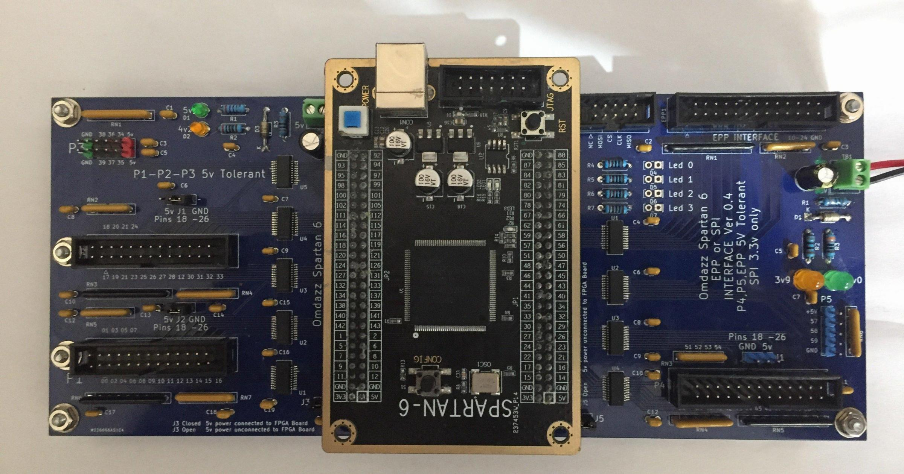

# Linuxcnc-FPGA
Notes and files relating to Spatan6 dev board &amp; Mesa firmware adaptation
<ol>
<li>V02 Board is on the left of the image</li>
<li>V04 Board is on the right of the image</li>
</ol>

Has been tested with the new hm2_spix driver for the RPi5 (which is required for Mesa 7c81 & 7C80) 
  As of Dec 23, 2024 currently no packages are available with this driver, 
Linuxcnc will need building from source and either use as Run In Place or end user will need to build  
packages themsleves and install, this is only required for the RPi5. If using an RPi4 or RPi400 nothing needs to be done.

Originally I used a usb-blaster for JTAG programming but after a while it was failing, I would recommend a FT2232 board 
for initial programming. I find openFPGALoader the easiest to use.

FPGA used can be found here [Aliexpress Omdazz Store](https://tinyurl.com/omdazzstore)

